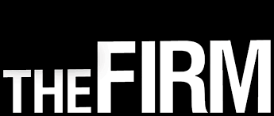

The firm is an open source book writing workshop.
It's a place where groups of people looking to share research can meet and work on a book.

At present,
the firm is working on a title called *The Campaigns*,
a look at the history of social behavior campaigns in American society post World War Two.

